# AI Assignment 2.1: Hinglish Chatbot Framework Report

**Project:** Multi-Model LLM Comparison for "GogginsBot"
**Date:** November 2025
**Author:** Hiten Gupta

---

## A. Cost Analysis

### 1. Pricing Model Used
*Costs calculated per 1 Million Tokens (based on provided pricing).*
* **Cohere Command A (03-2025):** $2.50 Input / $10.00 Output
* **OpenAI GPT-4o:** $2.50 Input / $10.00 Output
* **Gemini 2.0 Flash:** $0.10 Input / $0.40 Output

### 2. Cost Per Call (Actuals)
*Calculated from the average token usage in our experiment.*

| Model | Avg Input Tokens | Avg Output Tokens | Cost per 1k Calls ($) |
| :--- | :---: | :---: | :---: |
| **Gemini 2.0 Flash** | 113 | 290 | **$0.13** |
| **OpenAI GPT-4o** | 110 | 109 | $1.37 |
| **Cohere Command A** | 110 | 136 | $1.64 |
| **Llama 3 (Local)** | 111 | 250 | $0.00 (Electricity only) |

### 3. Estimated Monthly Cost
*Scenario: 1,000 active users making 5 queries per day (150,000 queries/month).*

* **Most Expensive (Cohere):** ~$246.40 / month
* **Cheapest Commercial (Gemini):** ~$19.20 / month
* **Analysis:** Gemini 2.0 Flash is approximately **12x cheaper** than Cohere Command A and GPT-4o. For a startup or high-volume application, Gemini offers the only viable unit economics, despite the slight drop in linguistic quality.

---

## B. Latency Analysis

### 1. Latency Comparison Chart (Seconds)

| Model | TTFB (Time to First Token) | Total Latency (Full Response) |
| :--- | :--- | :--- |
| **Cohere Command A** | **0.60 s** (Fastest Start) | 6.21 s |
| **Gemini 2.0 Flash** | 0.98 s | **3.32 s** (Fastest Complete) |
| **OpenAI GPT-4o** | 1.69 s | 4.08 s |
| **Llama 3 (Local)** | 19.97 s | 80.83 s |

### 2. TTFB Analysis
* **Cohere Command A (0.60s):** Cohere's infrastructure is heavily optimized for enterprise RAG and chat workloads where initial responsiveness is critical. The low TTFB suggests highly efficient "pre-fill" processing (ingesting the prompt) and a lack of heavy safety-filter overhead compared to broader consumer models.
* **Gemini 2.0 Flash (0.98s):** Google's use of TPU (Tensor Processing Unit) infrastructure provides massive throughput. "Flash" models are specifically distilled or architected (likely Mixture-of-Experts) to reduce the computational path for the first token, consistently keeping start times under 1 second.
* **OpenAI GPT-4o (1.69s - Moderate):** While highly intelligent, GPT-4o exhibits a higher TTFB. This is likely due to:

System Load: As the most popular model globally, requests often sit in a routing queue before hitting a GPU.

Safety Guardrails: OpenAI applies rigorous content filtering before generation begins, adding millisecond overhead.

MoE Routing: Routing the prompt to the correct expert parameters in a massive Mixture-of-Experts architecture takes non-trivial compute time.
* **Llama 3 (19.97s):** The local model's performance indicates a hardware bottleneck. The 20-second delay is the system struggling with Memory Bandwidth. Moving model weights from RAM to the compute unit (CPU/GPU) took significantly longer than the actual generation, proving that consumer hardware without quantization is the primary limiting factor for local LLMs.

---

## C. Model Comparison & Quality

### 1. Automated Evaluation Scores (Judged by Qwen 2.5)
*Scores out of 50 (fluency, relevance, tone, accuracy, safety).*

| Model | Average Score | Hinglish Fluency (0-10) | Tone Consistency (0-10) |
| :--- | :---: | :---: | :---: |
| **Cohere Command A** | **45.0** | **9.0** | **10.0** |
| **OpenAI GPT-4o** | 44.0 | 9.0 | 10.0 |
| **Gemini 2.0 Flash** | 42.7 | 8.3 | 9.3 |
| **Llama 3 (Local)** | 41.3 | 8.3 | 9.3 |

### 2. Pros & Cons
* **Cohere Command A (Winner on Quality):**
    * **Pros:** Achieved the highest overall score (45.0). It perfectly nailed the "Goggins" persona (10/10 Tone) and had the fastest TTFB.
    * **Cons:** Most expensive model in the test set (~$246/mo). Even though it scored high in hinglish fluency but generated text in devanagri script in zero shot strategy.
* **OpenAI GPT-4o:**
    * **Pros:** Very consistent. Tied for best Hinglish and Tone.
    * **Cons:** Higher TTFB (1.69s) makes it feel slightly more sluggish than Cohere.
* **Gemini 2.0 Flash (Winner on Value):**
    * **Pros:** Incredible speed (3.3s full response) and unbeatable price ($19/mo).
    * **Cons:** Slightly lower Hinglish fluency (8.3), occasionally drifting into more formal language.
* **Llama 3 (Local):**
    * **Pros:** Complete data privacy.
    * **Cons:** Failed the latency test completely (~81s response time). Needs quantization or better hardware to be viable.

### 3. Final Verdict
**Best for Production: Gemini 2.0 Flash**
While Cohere Command A scored slightly higher on quality (45 vs 42.7), the cost difference is massive. Gemini provides 95% of the quality for 8% of the cost. For a customer-facing bot, the sub-1-second latency and low price make it the superior engineering choice.

---

## D. Architecture Diagram
*System Overview*

```mermaid
graph TD
    %% --- PART 1: EXPERIMENT & BENCHMARKING (THE CORE ASSIGNMENT) ---
    subgraph "Phase 1: Offline Experimentation Pipeline"
        
        subgraph "Step 1: Prompt Strategy Design"
            P1["Zero-Shot Prompt"]
            P2["Few-Shot Prompt"]
            P3["Structured Prompt"]
        end

        subgraph "Step 2: Multi-Model Execution"
            P1 & P2 & P3 --> M1["OpenAI GPT-4o"]
            P1 & P2 & P3 --> M2["Gemini 1.5/2.0"]
            P1 & P2 & P3 --> M3["Cohere Command"]
            P1 & P2 & P3 --> M4["Llama 3 (Local)"]
        end

        subgraph "Step 3: Data Logging"
            M1 & M2 & M3 & M4 --> RawFiles["/responses/*.txt"]
            M1 & M2 & M3 & M4 --> CostCSV["cost_latency.csv"]
        end

        subgraph "Step 4: Automated Evaluation"
            RawFiles --> Judge["Judge Model (Qwen 2.5-7B)"]
            Judge -- "Scores (Fluency, Tone, Safety)" --> EvalJSON["evaluations.json"]
        end
    end

    %% --- PART 2: PRODUCTION SYSTEM (BONUS) ---
    subgraph "Phase 2: Production System (React + FastAPI + RAG)"
        LiveUser["Live User"] --> ReactUI["React Frontend (Chat Widget)"]
        
        subgraph "Backend Logic (FastAPI)"
            ReactUI -- "POST /chat/stream" --> Controller["Chat Controller"]
            
            subgraph "Context Retrieval"
                Controller --> CacheCheck{"LRU Memory Cache"}
                CacheCheck -- "Miss" --> VectorDB[("ChromaDB (Policies)")]
                VectorDB -- "Retrieved Chunks" --> CacheCheck
            end
            
            subgraph "Structured Generation"
                CacheCheck -- "Context + Persona" --> PromptEngine["Structured Prompt Builder"]
                PromptEngine -- "Final System Prompt" --> Gemini["Gemini 2.0 Flash"]
            end
            
            Gemini -- "SSE Stream" --> ReactUI
        end
    end
```

